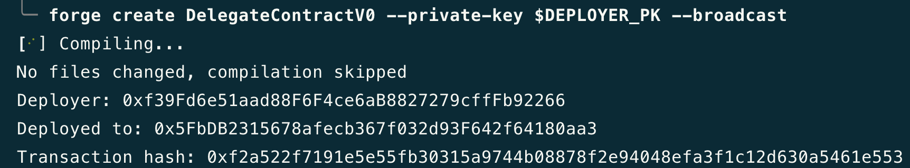
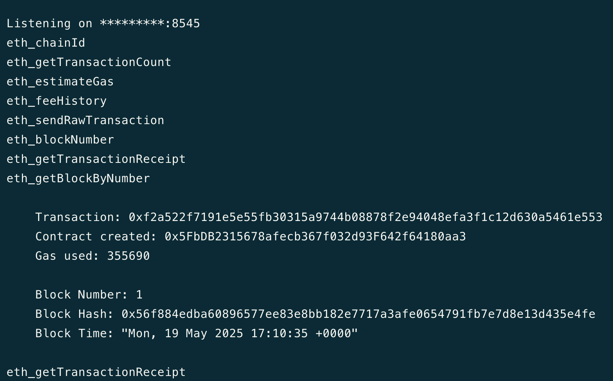
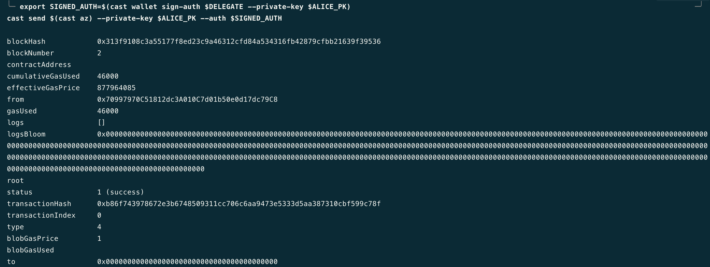

# 你的名字

1. 自我介绍：我是 Alex，一名 Solidity 合約開發者。
2. 你认为你会完成本次残酷学习吗？ 會
3. 你的联系方式（推荐 Telegram）：無

## Notes

<!-- Content_START -->

### 2025.05.14

本日學習內容：

-   https://www.nethermind.io/blog/eip-7702-attack-surfaces-what-developers-should-know

筆記內容

> # Introduction
>
> Ethereum 有兩種帳戶類型：
>
> -   Externally Owned Accounts (EOAs)：由私鑰控制，沒有鏈上程式碼（如 Metamask）。
> -   Smart Contract Accounts：具備鏈上邏輯，能執行複雜操作。
>
> EIP-7702 的目標是讓 EOAs 可以擁有「程式碼」，將其功能接近 Smart Contract Accounts。
>
> 新功能範例： 批次處理操作（batching）、原生多重簽章（multisig）
> 風險警告：若實作不當或缺乏審計，將導致新的安全漏洞。
>
> # What is EIP-7702?
>
> -   EIP-7702 引入一種新交易類型(0x04 type transaction)，讓帳戶可以設定並指派程式碼給自己。
> -   實作方式：
>     -   非直接將合約碼儲存在帳戶中。
>     -   使用一個特殊前綴 0xef0100 加上位址形成的指標，指向鏈上的合約地址（delegation designator）。
>     -   錢包僅「指向」一個智慧合約，由該合約邏輯決定帳戶行為。
> -   新交易型別的關鍵要素：
>     -   Authorization List（授權清單）：
>         -   結構：[chain_id, address, nonce, y_parity, r, s]
>         -   包含鏈 ID、智慧合約地址、nonce 與簽名資料。
>     -   Delegation Mechanism（委託機制）：
>         -   EOA 可藉由委託方式執行高階功能，例如：
>             -   在一筆交易中執行多個操作（batching）
>             -   替新用戶代付 gas（gas sponsorship）
> -   與 Smart Contract Account 的差異：
>     -   即使行為由智慧合約控制，EOA 的私鑰仍有完全控制權。
>     -   安全風險：私鑰一旦被竊取，攻擊者能完全掌控帳戶，即便有委託合約。
>
> # Comparison with EIP-4337
>
> -   EIP-7702：
>     -   允許 EOA 使用鏈上程式碼指標（code pointer） 來委託其行為。
>     -   設計較輕量（leaner integration）。
>     -   更適合特定用例的直接整合。
> -   EIP-4337：
>     -   採用 更全面的 Account Abstraction 架構。
>     -   使用 off-chain bundler 和 專用的 EntryPoint 智慧合約。
>     -   提供更完整的擴充性與功能。
>
> 兩者關係都是在提升帳戶功能與抽象能力。EIP‑7702 與 EIP‑4337 並不互斥，可並存。各自適用於不同的需求與場景，合力推進 Ethereum 帳戶模型的演進。

### 2025.05.15

本日學習內容：

-   https://www.nethermind.io/blog/eip-7702-attack-surfaces-what-developers-should-know
-   [A Deep dive into EIP-7702 with best practices](https://www.youtube.com/watch?v=uZTeYfYM6fM)

> # Security Risks and Vulnerabilities
>
> 開發委託合約（delegate contract）本身並不直覺，以下是開發者需要知道關於 EIP-7702 的特性:
>
> -   多個 EOA 可以同時指向同一個委託合約（delegate contract）
> -   用戶可以重新委託（redelegate），從一個委託合約切換到另一個。
> -   EOA 擁有者可以將委託設為 address(0) 來清除程式碼，將帳戶恢復為「普通 EOA」。
>
> 以下是常見漏洞
>
> ## 1. Access Control
>
> ### 1.1 Lack of access control
>
> 若 delegate contract 缺乏存取控制（Access Control），任何人都能代表 EOA 執行任意邏輯，例如轉走資產。
>
> ```solidity
> //SPDX-License-Identifier: MIT
> pragma solidity 0.8.20;
>
> contract VulnerableContract {
>   function doSomething(bytes memory _data, address _to, uint _value) public payable {
>       (bool success, ) = \_to.call{value: \_value}(\_data);
>       require(success);
>   }
> }
> ```
>
> -   任何人都能調用 `doSomething`，執行任何目標合約的函式呼叫，包含轉走 EOA 下所有資產。
>
> ## 2. Initialization challenges
>
> ### 2.1 Constructors
>
> -   當 EOA 授權成為 delegate contract 時， EOA 並不會執行 delegate contract 中的 constructor，也是就說 EOA 無法靠 constructor 來進行參數初始化的動作。
>
> ```solidity
> //SPDX-License-Identifier: MIT
> pragma solidity 0.8.20;
>
> contract Random {
>     uint a;
>     constructor(uint _someNumber) {
>         a = _someNumber;
>     }
> }
>
> ```
>
> 當 Alice 將 EOA 委派變成 Random 合約時，合約在委派過程中並不會執行 constructor。如果 Alice 想初始化變數，應該採用初始化函式（initialize pattern），類似 proxy 合約的初始化邏輯。
>
> ### 2.2 Front running and (re)initialization
>
> 如果 delegate contract 中的 `initialize` 函式無適當存取控制，可能會被惡意第三者進行 Front run 攻擊。
>
> ## 3. Storage collisions
>
> ### 3.1 Persistent state across redelegations and upgrades
>
> 當用戶重新委託或是恢復成為普通的 EOA 時，在委託成 delegate contract 時，所使用到的 storage 並不會被清除，而這可能會讓用戶在不同 delegate contract 切換時出現 storage collision 的問題。

### 2025.05.16

本日學習內容：

-   [A Deep dive into EIP-7702 with best practices](https://www.youtube.com/watch?v=uZTeYfYM6fM)

> # EIP-7702 Transaction Process
>
> 
>
> -   交易執行會增加 nonce，授權也會增加 nonce 值。如果授權 delegate contract 時，該 EOA 的 nonce 會增加 1，如果授權授權也自己簽一筆 EIP-7702 格是交易帶上鏈，那們 EOA nonce 就會增加 2。
> -   在 EIP-7702 交易中，會引入一個欄位叫 Authorization List，該欄位為一個存放多個 Authorization Tuple（`[chain_id, address, nonce, y_parity, r, s]`） 的陣列:
>     -   如果 Authorization Tuple 驗證成功，就會更新授權者 EOA 上的代碼。
>     -   如果 Authorization Tuple 驗證失敗，則直接跳下一個 Authorization Tuple 執行。
>
> # Best Practice
>
> ## Privatekey
>
> -   將 EOA 委任給智能合約後，雖然能在合約邏輯上實現各種保護資產的安全機制，但是私鑰仍然保有 EOA 控制的最高權限。因此，私鑰的保護仍然是首要任務。
> -   Not Your Keys, Not your coins.
>
> ## Multi-chain Replay
>
> -   當將 EOA 進行委託時，可以透過簽名中的 chainId 指定授權僅適用於特定鏈。然而，若將 chainId 設為 0，則表示用戶同意該授權在所有鏈上皆可生效，實現跨鏈授權的效果。但需要特別注意的是，即使同一地址在不同鏈上看似一致，實際上的實作細節可能存在差異。因此，在允許多鏈共用同一份授權時，務必特別謹慎，以避免潛在的安全風險或行為不一致的問題。
>
> ## Storage Management
>
> EIP-7702 切換或撤銷委託只會清除 code region，並不會清除掉 EOA 下使用過的 storage。
>
> -   對用戶來說，因為當前並沒有標準的安全切換 delegate contract 流程，因此在切換新的 delegate contract 前，最好是能確保 delegate contract 本身的開發團隊信良好，並且不要在 EOA 下保留太多資金。
> -   對開發者來說，在開發過程中可以遵循 ERC-7201，盡可能減少 Storage Collision 帶來的風險。
> -   對錢包廠商來說，如果 ERC-7779 後續有通過提案的話，可遵循提案的標準流程在每次切換委託時，都先將使用過的 storage 清除掉。
>
> ## Account Conversion
>
> -   在 EIP-7702 之後，EOA 帳戶具有智能合約的功能，意味著過去對於 `tx.origin` 一定是來自單純的 EOA （即 code region 為空）這項假設將不再成立。
> -   因此過去用來判斷單純 EOA 假設的方式： `tx.origin == msg.sender` 的方式也將不再可靠。

### 2025.05.17

本日學習內容：

-   [EIP-7702: A Deep Dive into Smart EOAs with Implementation Examples](https://hackmd.io/@colinlyguo/SyAZWMmr1x)

> # Introduction
>
> EIP-7702 為一般 EOA 帶來了許多可能性，以下是一些有趣的功能：
>
> -   社交恢復（Social Recovery）
>     -   適合擔心私鑰遺失的用戶。
>     -   可透過信任人群或設定機制恢復控制權。
> -   交易批次處理（Transaction Batching）
>     -   簡化交易流程，例如合併 ERC-20 的 approve + transfer。
>     -   更高效的 Token 操作。
> -   交易贊助（Transaction Sponsorship）
>     -   支援第三方代付 gas，如 Sequencer 或 Wallet Server。
>     -   對沒有原生代幣的用戶更加友善。
> -   任意簽章機制（Arbitrary Signing Keys）
>     -   可支援多種鑰匙格式，如 WebAuthn、P256、BLS 等。
>     -   提供更多安全與創新空間。
> -   Session Keys 支援
>     -   可設定有效期與操作範圍的臨時密鑰。
>     -   強化安全性、減少釣魚攻擊風險。
>     -   適合 DApp 沙箱操作與訂閱模型。
>
> # 與 ERC-4337 的整合性
>
> -   EIP-7702 可與 ERC-4337 完美整合。
> -   Smart EOAs 可直接用作 UserOperation.sender 欄位。
> -   利於開發者使用現有基礎設施，推動新功能落地。
>
> # 安全性討論
>
> -   EIP-7702 雖然可透過社交恢復的方式來解決私鑰遺失的問題，但仍無法解決私鑰洩漏的問題，因為私鑰對 EOA 仍然具有最高權限的控制權
> -   目前社區有提案 [EIP-7851](https://eips.ethereum.org/EIPS/eip-7851) 希望能夠允許禁用/啟用私鑰對於委託狀態下 EOA 的控制權
> -   不過提案目前還尚未通過，目前建議的做法是用戶授權完 EOA 變成 delegate contract 後，就直接棄用私鑰不在任何地方保存備份，以降低私鑰外洩的可能性。

### 2025.05.18

本日學習內容：

-   [EIP 7702 提案](https://eips.ethereum.org/EIPS/eip-7702)

> 引進 EIP-7702 之後，將打破以下三個不變性：
>
> -   **帳戶餘額只會在該帳戶主動發出的交易中減少**: 在 EIP-7702 之前，帳戶的餘額只有在該帳戶自己發起交易時才會減少。但在 EIP-7702 後改變了這一點，一旦帳戶被委託（delegated），其他人呼叫該帳戶時也可能導致它的餘額減少。
> -   **EOA 的 nonce 不會在交易執行過程中增加**: 在 EIP-7702 之前，EOA 的 nonce 僅會在交易開始前確認並增加，不會在執行過程中變化。但 EIP-7702 後改變了這一點，一旦帳戶被委託（delegated），它在執行交易時可以呼叫 CREATE 指令來部署新合約，這會使帳戶的 nonce 在執行過程中增加。
> -   **`tx.origin == msg.sender` 僅在最外層呼叫中成立**: 在 EIP-7702 之前，`tx.origin == msg.sender` 只會在最外層的交易呼叫中為真。在 EIP-7702 後改變了這一點，委託後的 EOA 可以在單一交易中發出多次內部呼叫，使 `msg.sender` 在不同執行上下文中變化，導致 tx.origin == msg.sender 不再只在頂層成立。

### 2025.05.19

本日學習內容：

-   使用 Foundry 在本地實測 EIP-7702 功能

> # 使用 Foundry 在本地測試 EIP-7702
>
> 使用 `anvil` 節點在本地啟用測試環境，並且開啟 Odyssey 功能：
>
> ```bash
> anvil --odyssey
> ```
>
> 選定一個測試用的 EOA 及其對應的私鑰加入環境變數：
>
> ```bash
> export DEPLOYER_PK=0xac0974bec39a17e36ba4a6b4d238ff944bacb478cbed5efcae784d7bf4f2ff80 export DEPLOYER_ADDRESS=0xf39Fd6e51aad88F6F4ce6aB8827279cffFb92266
> ```
>
> 用 `DEPLOYER` 部署一個 `DelegateContract` 合約：
>
> ```bash
> forge create DelegateContract --private-key $DEPLOYER_PK --broadcast
> ```
>
> 
>
> 
>
> 以下為 `DelegateContract` 合約：
>
> ```solidity
> // SPDX-License-Identifier: MIT
> pragma solidity ^0.8.20;
>
> /**
> * @notice VULNERABLE, UNAUDITED CODE. DO NOT USE IN PRODUCTION.
> * @author The Red Guild (@theredguild)
> */
> contract DelegateContract {
>    struct Call {
>        bytes data;
>        address to;
>        uint256 value;
>    }
>
>    error ExternalCallFailed();
>
>    function execute(Call[] memory calls) external payable { // lack of access control
>        for (uint256 i = 0; i < calls.length; i++) {
>            Call memory call = calls[i];
>
>            (bool success,) = call.to.call{value: call.value}(call.data);
>            require(success, ExternalCallFailed());
>        }
>    }
>
>    // no receive function nor payable fallback function
> }
> ```
>
> > [!WARNING]  
> > 注意 `DelegateContract` 合約僅供學習用，請勿在 production 環境使用。
>
> 將部署好的 `DelegateContract` 合約地址加入環境變數：
>
> ```bash
> export DELEGATE=0x5FbDB2315678afecb367f032d93F642f64180aa3
> ```
>
> 選定另一個測試用的 EOA 及其對應的私鑰加入環境變數，這個測試用的 EOA 我們取名叫 Alice：
>
> ```bash
> export ALICE_PK=0x59c6995e998f97a5a0044966f0945389dc9e86dae88c7a8412f4603b6b78690d export ALICE_ADDRESS=0x70997970C51812dc3A010C7d01b50e0d17dc79C8
> ```
>
> 我們待會要將 Alice EOA 授權委託變成 `DelegateContract` 合約，在此之前可以先檢查 Alice EOA 是否有包含 bytecode：
>
> ```bash
> cast code $ALICE_ADDRESS
> //output: 0x
> ```
>
> 接著用 Alice EOA 的私鑰（鏈下）簽署 EIP-7702 授權：
>
> ```bash
> cast wallet sign-auth $DELEGATE --private-key $ALICE_PK
>
> //output: 0xf85c827a69945fbdb2315678afecb367f032d93f642f64180aa38080a00a17b68dcbf7db8bafb45cbcbeb61316aa330f045e43425e1db41e6c794c2e64a01a7f46131075975b44ae67f3bc968a9bce64f257b24571d945bb9026812c114e
> ```
>
> 接著將 EIP-7702 授權結果帶上鏈：
>
> ```bash
> export SIGNED_AUTH=$(cast wallet sign-auth $DELEGATE --private-key $ALICE_PK)
> cast send $(cast az) --private-key $ALICE_PK --auth $SIGNED_AUTH
> ```
>
> 
>
> > [!WARNING]  
> > 理論上 Alice EOA 的 nonce 應該要變成 2，但是查看後只有 1，不確定是不是 Bug。
> > 將 EIP-7702 授權帶上鏈後，我們可以觀察到 Alice EOA 中含的 Bytecode 已經不一樣了：
>
> ```bash
> cast code $ALICE_ADDRESS
> //output: 0xef01005fbdb2315678afecb367f032d93f642f64180aa3
> ```
>
> 檢查 Alice EOA 地址下的 bytecode 長度，可看出 Alice EOA 的 bytecode 長度已經不為 0。
>
> ```bash
> cast codesize $ALICE_ADDRESS
> // 23
> ```
>
> 如果要取消授權變回普通的 EOA，只需將授權的委託地址指定為 0 地址：
>
> ```bash
> cast send $(cast az) --private-key $ALICE_PK --auth $(cast wallet sign-auth $(cast az) --private-key $ALICE_PK)
> ```
>
> 查看取消 EIP-7702 授權後的結果：
>
> ```bash
>  cast codesize $ALICE_ADDRESS
> //output: 0
> cast code $ALICE_ADDRESS
> //output: 0x
> ```

### 2025.05.20

本日學習內容：

-   針對昨天測試 EIP-7702 時發現的問題找原因

> 背景：昨天在測試 EIP-7702 授權時，如果是 Alice 自己授權且帶上鏈的情況下，Alice 的 nonce 值應該是要增加 2，但使用 foundry 測試時只有增加 1。
>
> 這邊經過幾次嘗試後，確定 nonce 值的計算有問題，所以我在 Foundry 的 repo 中，提了一個 issue，等待回覆後再來更新。
>
> issue: https://github.com/foundry-rs/foundry/issues/10573

### 2025.05.21

本日學習內容：

-   解決昨天提的 Issue

> 為什麼使用以下方式進行 EIP-7702 授權時，Alice 的 EOA nonce 只增加 1，而不是增加 2？
>
> ```bash
> export SIGNED_AUTH=$(cast wallet sign-auth $DELEGATE --private-key $ALICE_PK)
> cast send $(cast az) --private-key $ALICE_PK --auth $SIGNED_AUTH
> ```
>
> 因為 `cast wallet sign-auth` 是一個獨立的指令，它並不知道你接下來會如何使用這個簽名（例如：是否由同一個帳號發送交易，或交由其他帳號）。因此，它預設會使用該帳號當下的 nonce 作為簽名資料的一部分。
> 但若想讓 Alice 自我授權（即自己授權自己），其實不需要先手動簽名，而是可以直接這樣寫：
>
> ```bash
> cast send $(cast az) --auth $DELEGATE --private-key $ALICE_PK
> ```
>
> 這樣做時，`cast send` 會自動處理 nonce 的邏輯：它會將授權中使用的 nonce 設為 Alice 當前帳號 nonce + 1（因為當前的 nonce 會用來發送這筆交易）。如此一來，上鏈時就會同時遞增兩次 nonce，一次用於發送交易，一次用於授權簽名，達成自我授權時 nonce 增加 2 的正確行為。

### 2025.05.22

本日學習內容：

-   [PREP (Provably Rootless EIP-7702 Proxy) Method Deep Dive](https://blog.biconomy.io/prep-deep-dive/#goals)

> # Nicks’ Method 是什麼？
>
> 這個方法由以太坊創辦人之一 Vitalik Buterin 想出來，並由 Nick Johnson 首次實作。
> 它的核心是利用一個特性：
>
> > 在 EVM 中，一筆交易的「發送者地址」（`from`）可以被從交易本身的參數中恢復出來，透過一個叫 `ecrecover` 的函式。
>
> 也就是說，你不需要事先知道帳號的私鑰，只要你能構造出一筆交易，並填入一組看似有效的簽名（`r`, `s`, `v` 值），那你就可以找出一個與這簽名匹配的地址。
>
> ## 大致流程
>
> 1. 開發者準備好一筆交易（例如：發送 5 ETH 給某地址）。
> 2. 不用私鑰來簽名這筆交易，而是隨機產生一組簽名參數：r, s, v。
> 3. 用 ecrecover 函數，從這筆交易的內容 + 簽名，推導出一個帳號地址 A。
> 4. 然後開發者只要將「5 ETH + 手續費」發送到這個地址 A（也就是那個虛構出來的帳號）。
> 5. 最後，只要把這筆交易送出，EVM 會認為這筆交易是從地址 A 發出且簽名有效，所以它會被正常執行！
>
> 總結來說，Nicks’ Method 就像是一種 「逆向產生地址」 的方法：
>
> -   你先寫好交易，隨機造出一組簽名。
> -   然後你問 EVM：「哪個地址的私鑰會產生這組簽名？」
> -   再把錢給這個地址，讓它完成交易 —— 即便你從來不知道它的私鑰是什麼。
>     這就是所謂的 Keyless Execution（無私鑰執行）。
>
> # PREP 方法概覽
>
> PREP（Provably Rootless EIP-7702 Proxy） 是一種創新的帳戶部署方法，結合了 EIP-7702 的授權機制、Nicks’ Method（無私鑰執行）以及特殊的加密簽名推導。
> 這種方法允許開發者**在不擁有私鑰的情況下部署智能帳戶**，並確保沒有任何人能夠控制該帳戶的根私鑰。
>
> # PREP 方法實作步驟（結合 Nicks’ Method + EIP-7702）
>
> ## Step 1：產生 EIP-7702 授權訊息哈希
>
> 建立授權訊息的哈希，格式如下：
>
> ```javascript
> const messageHash = keccak256(
>     concat([
>         MAGIC_PREFIX, // 固定的前綴 (0x05)
>         rlp.encode([
>             0, // chain_id = 0（代表在所有鏈上都有效）
>             smart_account_address, // 智能帳戶地址（singleton 合約地址）
>             0, // nonce = 0（新帳戶）
>         ]),
>     ])
> );
> ```
>
> ## Step 2：隨機產生 ECDSA 簽名 (r, s, v)
>
> 這裡不需要私鑰，使用隨機數生成有效的簽名值：
>
> ```javascript
> const r = randomBytes(32); // 32 bytes 隨機值
> const s = randomBytes(32); // 需確保 s < secp256k1n / 2（符合 EIP-2）
> const v = randomChoice([27, 28]); // v 可為 27 或 28
> ```
>
> # Step 3：利用簽名還原簽名者地址
>
> 從上述 messageHash 和 signature 中 recover 一個帳戶地址：
>
> ```javascript
> const signature = concat([r, s, v]);
> const recoveredAddress = recoverAddress(messageHash, signature);
> ```
>
> 這個 recoveredAddress 即為最終要變成智能帳戶的帳戶地址，你並不知道它的私鑰。
>
> # Step 4：構造 EIP-7702 授權資料（Tuple）
>
> ```javascript
> const authorization = {
>     chain_id: 0,
>     address: smart_account_address, // singleton 智能帳戶邏輯合約地址
>     nonce: 0,
>     y_parity: v,
>     r: r,
>     s: s,
> };
> ```
>
> # Step 5：上鏈提交 EIP-7702 交易
>
> 建構一筆交易，使用 type `0x04`（EIP-7702 類型），其 authorizations 陣列中包含上面構造的 authorization：
>
> -   這筆交易將 recoveredAddress 設為 smart_account_address 的代理。
> -   帳戶成功轉化為智能帳戶！
>
> # Step 6: 初始化智能帳戶（可選，但常見）
>
> 部署後的智能帳戶需要初始化，依照你的設計邏輯可能包括：
>
> -   設定 owner（可為 EOA、Passkey、MPC、社交恢復等）
> -   設定簽名邏輯與授權模式
> -   綁定外部控制機制或策略模組
>
> 這步驟依賴你的帳戶合約邏輯，可以在上鏈交易中一次性完成（constructor/init call）。

<!-- Content_END -->
